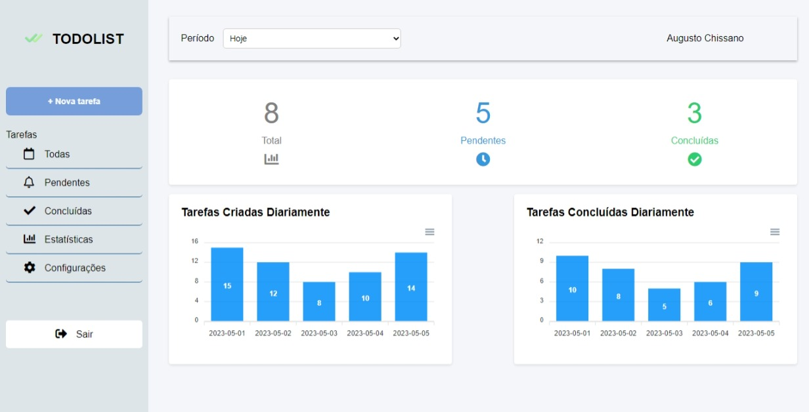

# 🎯 TODOLIST





## 📝 Sobre
Projecto fullstack, um aplicativo web intuitivo para gerenciamento de tarefas! Com recursos abrangentes e uma interface amigável, o aplicativo simplifica o processo de organização e acompanhamento de tarefas diárias.

Recursos :
- Criação de tarefas: Crie facilmente tarefas personalizadas.
- Acompanhamento do progresso: Marque tarefas como concluídas.
- Visualização personalizada: Navegue facilmente por suas tarefas pendentes, concluídas e até mesmo visualize estatísticas.
- Painel de estatísticas: Acesse gráficos, uma forma adequada de visualizar o progresso.
- Área de login e cadastro

Valorizo comentários e sugestões, portanto, sinta-se à vontade para me contactar com suas opiniões e ideias de melhorias.


## 🔍 Tecnologias utilizadas

``Front-end:`` HTML, CSS, JS

######

``Back-end:`` NodeJS, Bcrypt, Express, JWT, Mongoose, MongoDB


## 🔧 Configuração

Execute os seguintes passos para a configuração do projeto:

**Back-end**
1. Execute o comando ``npm install``
2. Altere o valor da variável ***SECRET*** em ``.env``

Para **SECRET**, você poderá informar qualquer coisa, uma vez que isso é uma chave única e que somente você terá acesso, a variável servirá para validar o usuário no backend.


Ao final, seu arquivo ``.env`` deverá ser algo semelhante a isso:

```
SECRET=ed9733e-5t80-436e-e046-347cj9d4d4k4
```


## 🚀 Funcionamento

  

Execute os seguintes comandos para iniciar o projeto em localHost:

**Back-end**
```
npm start
```

**Front-end**
```
Execute o arquivo index.html (Página de Login)
```

  

## 🤝 Desenvolvedor

  

<table>

<tr>

<td  align="center">

<a  href="https://github.com/Augusto-Chissano"  width="100px;">

<br>

<strong>Augusto Horácio Chissano</strong>

</a>

</td>

</tr>

</table>